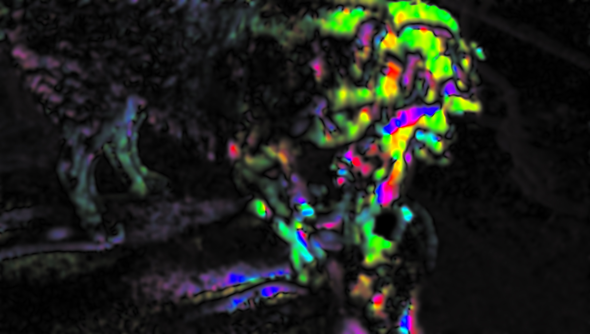
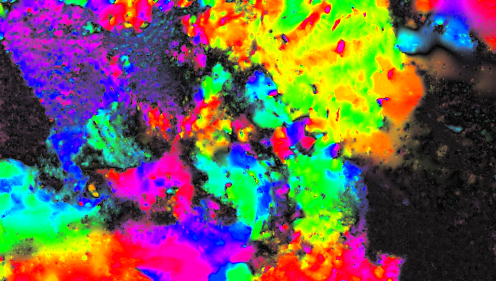

# CSE 455 Homework 3 #
#### UPDATED: Sunday,  Nov4 9am: Updated this Readme and flow_image.cpp to clarify few issues ####
#### UPDATED: Monday,  Nov5 3pm: Clarified Time structure matrix (section 1.x) ####
#### UPDATED: Monday,  Nov6 12am: Clarified Structure matrix filters (section 1.x) ####

Welcome friends,

It's time for optical flow!

To start out this homework, copy over your `process_image.cpp`, `filter_image.cpp`, `resize_image.cpp`, `harris_image.cpp`, and`panorama_image.cpp` files from hw2 to the `src` directory in this homework. We will be continuing to build out your image library. If you want to test your previous homeworks just copy the necessary data from the previous homework folder.

## 1. Lucas-Kanade optical flow ##

We'll be implementing [Lucas-Kanade](https://en.wikipedia.org/wiki/Lucas%E2%80%93Kanade_method) optical flow. We'll use a structure matrix but this time with temporal information as well. The equation we'll use is:

Note the first matrix consists of 3 different elements and corresponds to `S'S` from the lecture slides and the second term is a 2-vector corresponding to `S'T`. We put the resulting 5 numbers in the so called Time-structure-matrix. **Here `It` means temporal derivative in the usual sense `It(x,y)=f(x,y,t+1)-f(x,y,t)`.** Hence the matrix `T` contains negative sign to match what we had in lecture. **Also for spatial derivatis use the standard -101 filters, unlike HW2**. We are very sorry for the confusion.

## 1.1 Time-structure matrix ##

We'll need spatial and temporal gradient information for the flow equations. Calculate a time-structure matrix. Spatial gradients can be calculated as normal. The time gradient can be calculated as the difference between the previous image and the next image in a sequence. Fill in `time_structure_matrix`. At the end filter the resulting matrix with a `sigma=s`. Use the provided function `fast_smooth_image` for fast gaussian smoothing.

## 1.2 Calculate the eigenvalues of `S'S` ##

To know whether we have enough information to compute the optical flow we need to know whether the matrix `S'S` is invertible.
Compute the two eigenvalues per pixel and return an image with two channels

## 1.3 Calculating velocity from the structure matrix ##

Fill in `velocity_image` to use the equation to calculate the velocity of each pixel in the x and y direction. For each pixel, produce a matrix `S'S` and a vector `S'T` using the classes `class Matrix2x2` and `class Vector2`. Invert the matrix, and use it to calculate the velocity.

Try calculating the optical flow between two dog images

    Image a = load_image("data/dog_a.jpg").rgb_to_grayscale();
    Image b = load_image("data/dog_b.jpg").rgb_to_grayscale();
    Image flow = optical_flow_images(b, a,5,5);
    Image colorflow=vel2rgb(flow,10);
    save_image(colorflow, "output/dog_vel");
  

It may look something like:

## 2. Implement Iterative refinement and Pyramidal refinement ##

For your convenience computing the sequence of pyramidal images has been implemented. You need to implement two methods. 

First is `velocity_resize`. You computed the velocity image at a lower resolution. Now you want to estimate flow at the larger resolution in the pyramid, and you need to initialize the flow at the larger resolution with the one from the smaller resolution.  The function takes the old flow and the new sizes which are bigger and you need to return the updated flow. Think about what rescaling/resizing the flow means. Is it just image resizing?

After you have updated flow, you can run iterative LK. That means running one iteration of LK, obtainig a flow `v` from image `t0` to `t1`, and warping `t0` accoring to the flow `v`. That means sending each pixel from `t0(x,y)` to the location `(x+vx,y+dy)=(x+v(x,y,0),y+(v,x,y,1))`. Think what is necessary to achieve that. What do you do if a pixel does not move exactly to a new integer coordinates pixel? What do you if no pixel goes to a given new pixel `(x,y)`? You can answer and implement these questions using techniques we studied in class.

To peform warp, for each pixel in the warped image accumulate contributions from the warped old image pixels by keeping a `sum_weights` image and a `sum_weighted_value` image and then normalizing the values after processing all the pixels. For each pixel in the old image, compute the new location `(x1,y1)=(x+vx,y+vy)`. It is likely that it will not fall on exact integer coordinates therefore we compute the same bilinear weights as in bilinear interpolation and use those weights to update the new pixels. For each of the 4 surrounding pixels use the weight and the value to update the `sum_weights` and `sum_weighted_value` images. Overall the `sum_weights` image should contain the sum of the weights of all individual contributions and `sum_weighted_value` should contain the weighted value contributions.

Some pixels might happen to have zero weight. To prevent that, initialize the `sum_weights` image and the `sum_weighted_value` image with some small value (for example 1e-4, as suggested in the code): `sum_weights=old_weight` and `sum_weighted_value=old_weight*original_value`.

For your convenience we have proivided the function `compute_iterative_pyramid_LK` that drives the algorithm.

Now running:

    Image a = load_image("data/dog_a.jpg");
    Image b = load_image("data/dog_b.jpg");
    Image ag = a.rgb_to_grayscale();
    Image bg = b.rgb_to_grayscale();
    Image flow = optical_flow_images(bg, ag,5,5);
    Image colorflow=vel2rgb(flow,10);
    save_image(colorflow, "output/dog_vel");
    
    LKIterPyramid lk;
    lk.pyramid_levels=8;
    lk.vel_color_scale=20;
    lk.clamp_vel=50;
    
    lk.t1=b;
    lk.t0=a;
    lk.pyramid0=make_image_pyramid(ag,lk.pyramid_factor,lk.pyramid_levels);
    lk.pyramid1=make_image_pyramid(bg,lk.pyramid_factor,lk.pyramid_levels);
    
    compute_iterative_pyramid_LK(lk);
    
    save_image(lk.colorflow, "output/dog_vel_improved");
    
Should give us:
    

## 3. Testing and optical flow demo using OpenCV or Pangolin ##

You can run `./test3` which does some basic tests and outputs `dog_vel.jpg` and `dog_vel_improved.jpg`

Using OpenCV and Pangolin we can get images from the webcam and display the results in real-time. You need to install OpenCV. On CentOS/Fedora  run `sudo yum install opencv-devel.x86_64`. On Debian/Ubuntu `sudo apt-get install libopencv-dev`. 

Then you can run `./test3 live` which will open your webcam and display 4 images: Current frame, velocity image, warped previous frame according to velocity and last is the error between warped image and current frame.

If you want to be able to change parameters of your algorithm, you have to use Pangolin. Just like before install it and then compile your code (Note: Pangolin requires OpenCV to display webcam stream). 

You can run `./optical-flow` to try running webcam.

You can run `./optical-flow video.pango` to try running prerecorded stream.

You can run `./optical-flow a.jog b.jpg` to try running optical flow only between these two images.

You can download a sample `video.pango` from this [link](https://drive.google.com/open?id=1xKisY2312YoGs1FOQfk4XGdnJ0iSuiq8)

## 4. Turn it in ##

Turn in your `flow_image.cpp` on canvas under Assignment 3.
